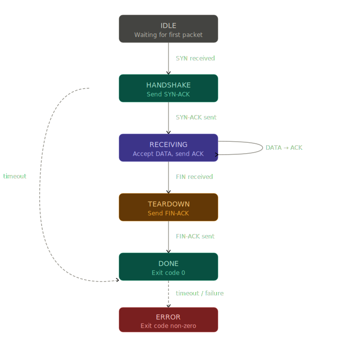
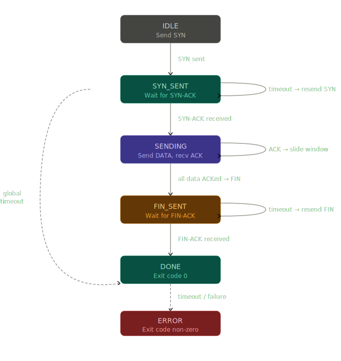

# ipk-rdt — Reliable Data Transfer over UDP

**Author:** Lukas Mader  
**Course:** IPK 2025/2026 — Project 2  

---

## Overview

`ipk-rdt` is a command-line tool that implements reliable, ordered byte-stream transfer over UDP. It consists of a single executable that runs in either server (receiver) or client (sender) mode. The underlying transport protocol — referred to here as the **GG protocol** (magic bytes `0x4747`) — is a custom application-level reliable transport inspired by TCP, implementing a sliding window, cumulative acknowledgements, CRC32 integrity checking, and RFC 6298 adaptive retransmission timers.

---

## Build and Run

### Requirements

- GCC with C17 support (`-std=c17`)

### Build

```sh
make
```

The binary `ipk-rdt` is placed in the repository root.

### Run

**Server (receiver):**
```sh
./ipk-rdt -s -p PORT [-a ADDRESS] [-o OUTPUT] [-w TIMEOUT]
```

**Client (sender):**
```sh
./ipk-rdt -c -a HOST -p PORT [-i INPUT] [-w TIMEOUT]
```

| Option | Description |
|--------|-------------|
| `-s` | Start in server (receiver) mode |
| `-c` | Start in client (sender) mode |
| `-p PORT` | UDP port number (1–65535) |
| `-a ADDRESS/HOST` | Bind address (server) or destination host (client) |
| `-o OUTPUT` | Output file; `-` or omitted means stdout |
| `-i INPUT` | Input file; `-` or omitted means stdin |
| `-w TIMEOUT` | Progress timeout in seconds (default: 1) |
| `-h`, `--help` | Show usage and exit with code 0 |

### Examples

```sh
# File to file
./ipk-rdt -s -p 9000 -o received.bin
./ipk-rdt -c -a 127.0.0.1 -p 9000 -i input.bin

# stdin to stdout
./ipk-rdt -s -p 9000
printf 'IPK\n' | ./ipk-rdt -c -a 127.0.0.1 -p 9000

# IPv6
./ipk-rdt -s -p 9000 -o received.bin
echo "hello" | ./ipk-rdt -c -a ::1 -p 9000
```

---

## Protocol Design

### Packet Header Format

Every protocol data unit (PDU) consists of a fixed 22-byte header followed by an optional payload:

```
 0                   1                   2                   3
 0 1 2 3 4 5 6 7 8 9 0 1 2 3 4 5 6 7 8 9 0 1 2 3 4 5 6 7 8 9 0 1
+-+-+-+-+-+-+-+-+-+-+-+-+-+-+-+-+-+-+-+-+-+-+-+-+-+-+-+-+-+-+-+-+
|            Magic (0x4747)     |     Type      |               |
+-+-+-+-+-+-+-+-+-+-+-+-+-+-+-+-+-+-+-+-+-+-+-+-+               +
|                        Connection ID (32 bits)                |
+-+-+-+-+-+-+-+-+-+-+-+-+-+-+-+-+-+-+-+-+-+-+-+-+-+-+-+-+-+-+-+-+
|                       Sequence Number (32 bits)               |
+-+-+-+-+-+-+-+-+-+-+-+-+-+-+-+-+-+-+-+-+-+-+-+-+-+-+-+-+-+-+-+-+
|                  Acknowledgement Number (32 bits)             |
+-+-+-+-+-+-+-+-+-+-+-+-+-+-+-+-+-+-+-+-+-+-+-+-+-+-+-+-+-+-+-+-+
|         Data Length (16 bits) |       Checksum (32 bits)      |
+-+-+-+-+-+-+-+-+-+-+-+-+-+-+-+-+               +---------------+
|               Checksum (cont.)                |    Padding    |
+-+-+-+-+-+-+-+-+-+-+-+-+-+-+-+-+-+-+-+-+-+-+-+-+-+-+-+-+-+-+-+-+
|                      Payload (0–1178 bytes)                   |
+-+-+-+-+-+-+-+-+-+-+-+-+-+-+-+-+-+-+-+-+-+-+-+-+-+-+-+-+-+-+-+-+
```

| Field | Size | Description |
|-------|------|-------------|
| Magic | 2 B | Always `0x4747` ("GG"); identifies the protocol |
| Type | 1 B | Packet type (see below) |
| Connection ID | 4 B | Random 32-bit value identifying the session |
| Sequence Number | 4 B | Byte offset of the first payload byte |
| Acknowledgement | 4 B | Cumulative: acknowledges all bytes up to (not including) this offset |
| Data Length | 2 B | Payload length in bytes (0 for control packets) |
| Checksum | 4 B | CRC32 over the full PDU with checksum field zeroed |
| Padding | 1 B | Reserved, set to zero |

**Packet types:**

| Value | Name | Direction |
|-------|------|-----------|
| 1 | `SYN` | Client → Server |
| 2 | `SYNACK` | Server → Client |
| 3 | `ACK` | Both |
| 4 | `DATA` | Client → Server |
| 5 | `FIN` | Client → Server |
| 6 | `FINACK` | Server → Client |

Maximum PDU size is **1200 bytes** (header 22 B + payload up to **1178 B**).  
All multi-byte fields are encoded in **big-endian** (network byte order).

### Integrity Protection

The checksum field holds a **CRC32** computed over the entire PDU (header + payload) with the checksum field set to zero before computation. Any packet with an incorrect checksum, wrong magic, or truncated header is silently discarded.

### Connection Identification

Before sending the first SYN, the client generates a **random 32-bit connection ID** using `rand()`. Every subsequent packet for that session carries the same `conn_id`. The server records the `conn_id` from the first SYN and rejects packets with a different `conn_id`. This prevents accidental mixing of packets from different transfers and provides basic protection against stale packets from prior sessions.

Both the client's and server's initial sequence numbers are also generated randomly with `rand()`.

---

## Session Establishment and Termination

### Three-Way Handshake

```
Client                          Server
  |                                |
  |------ SYN (seq=ISN_c) -------->|
  |                                |
  |<----- SYNACK (seq=ISN_s, ------|
  |        ack=ISN_c+1)            |
  |                                |
  |------ ACK (ack=ISN_s+1) ------>|
  |                                |
  |        <DATA TRANSFER>         |
```

The server retransmits SYNACK with exponential backoff if the final ACK does not arrive within RTO. The client retransmits SYN similarly.

### Session Teardown

```
Client                          Server
  |                                |
  |------ FIN (seq=total_bytes) -->|
  |                                |
  |<----- FINACK (ack=total+1) ----|
  |                                |
  |------ ACK --------------------->|
  |                                |
exit 0                          exit 0
```

The client waits 50 ms after sending the final ACK before closing. The server retransmits FINACK until the ACK arrives or the timeout expires; a timeout at this point is treated as success.

---

## UML Diagrams

### Sequence Diagram



### Server State Machine



### Client State Machine




---

## Sequencing and Acknowledgement

**Byte-stream sequencing** is used: `seq` in a DATA packet is the byte offset of the first byte in the payload, identical to TCP. For example, if the client sends 1178 bytes starting at offset 0, the next packet's `seq` is 1178.

**Cumulative acknowledgements**: the `ack` field in an ACK packet means "I have received all bytes up to (not including) this offset." The server sends a cumulative ACK after every DATA packet it processes.

The client maintains a **sliding send window** of `WINDOW_SIZE = 32` slots. Each slot holds one segment, its sequence number, length, send timestamp, current RTO, and retransmit count. The window allows up to `32 × 1178 = 37 696` bytes of unacknowledged data in flight simultaneously.

---

## Retransmission Strategy and Timeout Handling

### Adaptive RTO — RFC 6298 (Jacobson Algorithm)

The client tracks RTT per connection and computes RTO adaptively:

```
First sample:
  SRTT   = RTT_sample
  RTTVAR = RTT_sample / 2

Subsequent samples:
  RTTVAR = (1 - 0.25) * RTTVAR + 0.25 * |SRTT - RTT_sample|
  SRTT   = (1 - 0.125) * SRTT  + 0.125 * RTT_sample
  RTO    = SRTT + 4 * RTTVAR
```

RTO is clamped to the range **[50 ms, 10 000 ms]**; the initial RTO before the first sample is **200 ms**.

**Karn's algorithm** is applied: RTT samples are taken only from segments that were not retransmitted, to avoid ambiguity.

### Retransmission Behaviour

- Each send-window slot has its own per-segment RTO timer.
- If a segment's timer expires, it is retransmitted and its RTO is doubled (exponential backoff).
- The global **progress timeout** (`-w TIMEOUT` seconds without any new ACK) terminates the transfer with a non-zero exit code.
- SYN and SYNACK retransmissions use the same initial RTO and the same exponential backoff.
- The event loop uses `select(2)` with a dynamically computed timeout equal to the nearest pending retransmit deadline (or 10 ms for the client, 50 ms for the server as a floor), avoiding busy-waiting.

---

## Duplicate and Out-of-Order Packet Handling

The server maintains a **receive buffer** of `WINDOW_SIZE = 32` slots indexed by `(seq / MAX_PAYLOAD) % WINDOW_SIZE`. Out-of-order segments are stored in the buffer without being written to output. When a contiguous run of segments starting at `rcv_expected` becomes available, they are written in order and `rcv_expected` is advanced.

Duplicate packets (seq < `rcv_expected`) are silently dropped, but an ACK is sent back so the client can advance its window. Packets outside the receive window (`seq >= rcv_expected + WINDOW_SIZE * MAX_PAYLOAD`) are also discarded.

The client deduplicates ACKs by ignoring any ACK with `ack <= send_base`.

---

## Segment Size and Window Behaviour

| Parameter | Value |
|-----------|-------|
| Max PDU | 1200 bytes |
| Header size | 22 bytes |
| Max payload | 1178 bytes |
| Window size | 32 segments |
| Max in-flight bytes | 37 696 bytes |

The 1200-byte PDU limit reduces IP fragmentation risk on both IPv4 and IPv6 paths. The 32-segment window allows efficient pipelining without overloading the receiver.

---

## Testing

### Running Tests

```sh
make test

or 

make test-protocol 
```
> **test-protocol:** only tests protocol implementation, tests were used in dev

### Test Environment

- OS: Linux (Arch Linux, kernel 6.x)
- Architecture: x86\_64
- Loopback interface (127.0.0.1 / ::1) used for all local tests
- `tc netem` used for network impairment tests (requires `sudo`)

### Test Coverage

#### Unit Tests (`tests/test_protocol.c`)

| # | What | Why | Expected |
|---|------|-----|----------|
| 1 | SYN packet (no payload) | Verify control-packet round-trip | Decoded fields match original |
| 2 | DATA packet with 5-byte payload | Verify payload encoding | Payload byte-for-byte identical |
| 3 | Corrupted payload (bit flip) | Detect integrity failure | `pkt_decode` returns false |
| 4 | Wrong magic number | Reject unrelated datagrams | `pkt_decode` returns false |
| 5 | Buffer shorter than header | Guard against truncated packets | `pkt_decode` returns false |
| 6 | Max payload (1178 bytes) | Boundary check | Full round-trip succeeds |

#### Integration Tests (`tests/test_rdt.sh`)

#### Integration Tests (`tests/test_rdt.sh`)

| # | What | Why | Condition |
|---|------|-----|-----------|
| 1 | Small string ("hello world") | Basic correctness | Content matches exactly |
| 2 | Empty input | Edge case — zero-byte transfer | 0 bytes received |
| 3 | Single byte | Minimal transfer | Content matches |
| 4 | Exactly 1178 bytes (one full segment) | Segment boundary | MD5 matches |
| 5 | 1179 bytes (just over one segment) | Segment boundary | MD5 matches |
| 6 | 1KB random binary | Binary data correctness | MD5 matches |
| 7 | 32KB (exactly one full window) | Window boundary | MD5 matches |
| 8 | 1MB random binary | Larger transfer | MD5 matches |
| 9 | 10MB random binary | Stream throughput | MD5 matches |
| 10 | Text file with newlines | Text correctness | Content matches |
| 11 | Binary file with null bytes | Binary correctness | MD5 matches |
| 12 | IPv4 explicit (127.0.0.1) | IPv4 code path | Content matches |
| 13 | IPv6 (::1) | IPv6 code path | Content matches |
| 14 | Hostname resolution (localhost) | DNS resolution | Content matches |
| 15 | File to stdout | stdout output mode | Content matches |
| 16 | stdin to file | stdin input mode | Content matches |
| 17 | stdin to stdout | Full pipe mode | Content matches |
| 18 | Client timeout (no server) | Timeout termination | Non-zero exit code |
| 19 | Server timeout (no client) | Timeout termination | Non-zero exit code |
| 20 | -w flag affects timeout duration | Timeout correctness | ~2s elapsed for -w 2 |
| 21 | Server bind on specific address | Bind correctness | Content matches |
| 22 | Client exit code 0 on success | Exit code correctness | Exit code 0 |
| 23 | Server exit code 0 on success | Exit code correctness | Exit code 0 |
| 24 | Invalid port (0) | CLI validation | Non-zero exit code |
| 25 | Missing -p PORT | CLI validation | Non-zero exit code |
| 26 | -s and -c together | CLI validation | Non-zero exit code |
| 27 | 10% packet loss (`tc netem`) | Retransmission correctness | MD5 matches |
| 28 | Packet reordering (`tc netem`) | Out-of-order handling | MD5 matches |
| 29 | 20% packet duplication (`tc netem`) | Duplicate handling | MD5 matches |
| 30 | Combined: loss + reorder + delay | Robustness under impairment | MD5 matches |

Tests 27–30 require `tc` and `sudo`; they are skipped automatically when unavailable.

---

## Known Limitations

- **Single transfer per process**: the server handles exactly one session and terminates, as required by the specification.
- **No parallel clients**: only one client can connect per server run.
- **No congestion control**: the window is fixed at 32 segments. Under severe congestion this may lead to suboptimal performance, though retransmission with exponential backoff prevents indefinite flooding.
- **No transfer resume**: if the process is killed mid-transfer, the partial output file is deleted on the server side.
- **Sequence number wrap-around**: the 32-bit sequence number space can theoretically wrap for transfers larger than ~4 GB. This case is not handled.

---

## AI Assistance

The following parts of this project were developed with the assistance of AI:

- `tests/test_protocol.c` — unit test file was generated with AI assistance
- `tests/test_rdt.sh` — integration test script was generated with AI assistance
- `README.md` — documentation structure and wording was assisted by AI
- Sliding window design — AI was consulted during design decisions
- AI was also used as a learning resource for topic.

All generated code and documentation was reviewed, understood, and adapted by the author.

---

## References

1. POSTEL, J. *RFC 768: User Datagram Protocol*. Internet Engineering Task Force, 1980.  
   Online: https://datatracker.ietf.org/doc/html/rfc768

2. POSTEL, J. *RFC 793: Transmission Control Protocol*. Internet Engineering Task Force, 1981.  
   Online: https://datatracker.ietf.org/doc/html/rfc793

3. ALLMAN, M., PAXSON, V., BLANTON, E. *RFC 6298: Computing TCP's Retransmission Timer*. 
   Internet Engineering Task Force, 2011.  
   Online: https://datatracker.ietf.org/doc/html/rfc6298

4. KUROSE, J. F., ROSS, K. W. *Computer Networking: A Top-Down Approach*. 8th ed. Pearson, 2021.

5. Linux manual page: *tc-netem(8)*.  
   Online: https://man7.org/linux/man-pages/man8/tc-netem.8.html

6. JACOBSON, V. Congestion avoidance and control. *ACM SIGCOMM Computer Communication Review*, 
   1988, vol. 18, no. 4, pp. 314–329.  
   Online: https://dl.acm.org/doi/10.1145/52325.52356

7. OSDev Wiki. *CRC32*.  
   Online: https://wiki.osdev.org/CRC32

8. LUCAS, J. *Understanding CRC32*.  
   Online: https://commandlinefanatic.com/cgi-bin/showarticle.cgi?article=art008

9. GeeksforGeeks. *Karn's Algorithm for Optimizing TCP*.  
   Online: https://www.geeksforgeeks.org/computer-networks/karns-algorithm-for-optimizing-tcp/